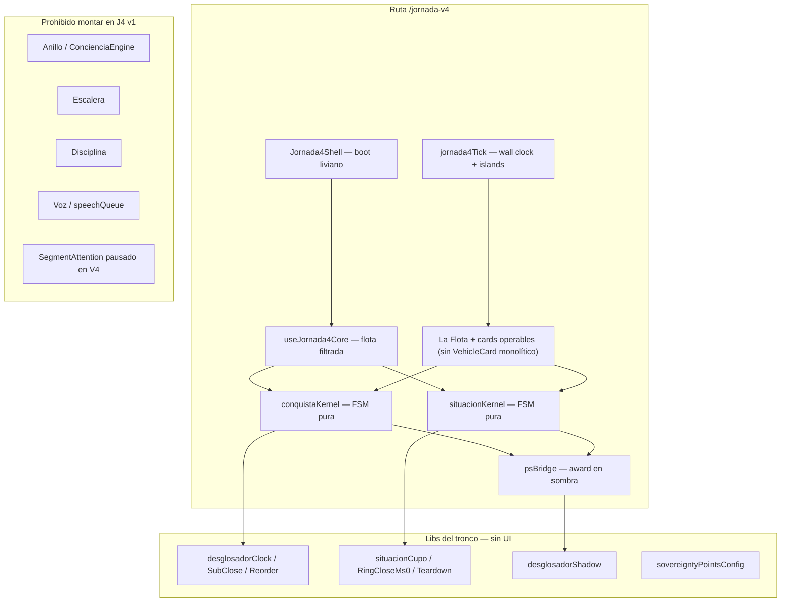

# Jornada 4 — Dual Kernel (estudio + arquitectura)

> Propuesta de nueva versión de Jornada centrada en **dos desglosadores** (Conquista + Situacional) + **sistema de puntos**.  
> Objetivo explícito: **no congelar**, resistir en segundo plano, y dejar fuera motores que hoy saturan el hilo principal.  
> Fecha: 2026-07-23 · Rama: `cursor/jornada4-dual-kernel-526f`

---

## 1. Veredicto del estudio

Los congelamientos no son un bug de un botón: son el resultado de **demasiados motores compitiendo por el mismo hilo** (React + flota + Firebase + reloj de conciencia + anillo + escalera + disciplina + voz + celebraciones) concentrados en `/planeacion` y, en menor medida, en V3.

**Filosofía ≠ código ejecutable en caliente.** El tronco V2 dice que cada pilar es “capacidad vendible”; en la práctica, montar todos los pilares a la vez en móvil convierte el producto en un monolito que se clava al cerrar un sub o un bloque.

Jornada 4 no intenta “optimizar el monolito otra vez”. **Corta el alcance** y reconstruye desde la lógica pura de los dos desglosadores.

| Qué entra en J4 (v1) | Qué queda fuera (por ahora) |
|----------------------|-----------------------------|
| Desglosador **Conquista** (`tiempo` + `tipoReloj: desglosador`) | Descanso / Punto Cero |
| Desglosador **Situacional** (ring + cupos + `subTareas`) | Verdad / Centinela |
| **Sistema de puntos (PS)** al cerrar sub / ciclo / bloque | Anillo de conciencia |
| Persistencia flota + sombra | Escalera de conciencia |
| Tick UI mínimo (islands) | Disciplina / puntualidad |
| Resistencia en background | Reloj/scheduler de conciencia global |
| **Crisol MOS** (dock clásico → ring / lista libre) | Voz (TTS / GPS clips) |
| | Termodinámica / segment attention acoplada |

---

## 2. Inventario del tronco (qué sacamos)

### 2.1 Conquista — núcleo puro reutilizable

| Archivo | Rol en J4 |
|---------|-----------|
| `client/src/lib/desglosadorClock.ts` | Relojes de sesión / sub (puro) |
| `client/src/lib/desglosadorSubClose.ts` | Payload de cierre de sub |
| `client/src/lib/desglosadorReorder.ts` | Reorden de unidades |
| `client/src/lib/desglosadorPointsAward.ts` | PS por sub + ciclo |
| `client/src/lib/desglosadorDepth.ts` | PS profundidad (opcional; puede ir a sombra o diferirse) |
| `client/src/lib/desglosadorCycleLiquidation.ts` | Liquidación ciclo (sombra) |
| `client/src/lib/desglosadorShadow.ts` | Primitiva `runShadowTask` / `yieldAfterPaint` |
| `client/src/components/planeacion/desglosadorSubLiveIsland.tsx` | Island 1s (UI espejo) |

**No arrastrar:** `desglosadorVoice*`, overlay de foco unidad acoplado a conciencia, handlers del manager monolítico (~4.2k líneas).

### 2.2 Situacional — núcleo puro reutilizable

| Archivo | Rol en J4 |
|---------|-----------|
| `client/src/lib/ringEnfoqueReal.ts` | Ring operable / liberar al taller |
| `client/src/lib/situacionCupoDistrib.ts` | Cupos, anclas, redistribución |
| `client/src/lib/situacionGanancia.ts` | Contrato hora fin / retos (mínimo necesario) |
| `client/src/lib/situacionRingCloseMs0.ts` | Paint optimista al cerrar fila |
| `client/src/lib/situacionDesgloseLiquidation.ts` | Liquidación bloque (sombra) |
| `client/src/lib/situacionSessionTeardown.ts` | Teardown limpio |
| `client/src/components/planeacion/situacionRelojIsland.tsx` | Island cupo |

**No arrastrar (v1):** `situacionAlerts` / voz, Crisol MOS, reserva táctica completa, sync a Proyecto Hub.

### 2.3 Puntos — núcleo

| Archivo | Rol |
|---------|-----|
| `client/src/lib/sovereigntyPointsConfig.ts` | Constantes PS |
| `awardSovereigntyPoints` en `persistence.ts` | Otorgar (siempre en **sombra**, nunca en ms0) |

### 2.4 Qué NO es base de J4

| Pieza | Por qué sale |
|-------|----------------|
| `concienciaClock` / `concienciaScheduler` / `ConcienciaEngine` | Pesa; pelea con islands; no es el desglosador |
| `AnilloConciencia*` | Mapa del día ≠ operación de unidad/cupo |
| `escaleraConcienciaEngine` | Métricas derivadas; no cierran unidades |
| `disciplinaEngine` / `puntualidadEngine` | Acopla segmentos al hot path |
| `SegmentAttentionBackground` en la ruta J4 | Pausado al entrar a `/jornada-v4` (App shell); se reanuda al salir |
| `useDesglosadorManager` | Orquestador monolítico; V3 ya demostró que se puede partir |
| Voz | Históricamente deja listeners / pelea con gestos; fase posterior |

---

## 3. Diagnóstico de freeze (clase del problema)

```
Gesto (Cumplido / Fallado / Cerrar bloque)
  → setState flota
  → JSON.stringify flota / disco
  → Firebase update(s)
  → award PS
  → arm entropy / rebuild timeline
  → celebración + voz
  → subscribers globales (centinela, segment attention)
= colapso del hilo principal en móvil
```

Leyes del tronco que **sí** se conservan (son técnicas, no filosofía de anillo):

1. **ms0** = mutar store + pintar + feedback mínimo.
2. **Sombra** = Firebase, PS, disco, liquidación.
3. **UI espejo** = cards sin lógica de negocio.
4. **Autarquía** = Conquista ≠ Situacional (no un solo handler genérico).
5. **Una clase, una solución** = un solo patrón de tick/persist para ambos.

Lo que J4 **rechaza** del tronco filosófico como *runtime siempre montado*: anillo, escalera, disciplina, entropía live en la sesión de desglose.

---

## 4. Idea de producto — Jornada 4

**Nombre interno:** Dual Kernel  
**Ruta propuesta:** `/jornada-v4` (paralela a `/planeacion` y `/jornada-v3`; no reemplaza hasta estabilizar)

### Experiencia v1

1. Abrir J4 → **La Flota visible** (grid Conquista + Enfoque) como en Jornada clásica; solo esos 2 tipos.
2. Lanzar vehículo → formulario con unidades/filas → aparece en **Vehículos activos** (card operable con lista + reloj).
3. Cerrar sub/fila → +PS visible (toast ligero) → sombra liquida.
4. Cerrar ciclo/bloque → +PS → teardown → listo.
5. Sin anillo, sin escalera, sin disciplina, sin voz (ni descanso/verdad).
6. Si la pestaña pasa a segundo plano: **el tiempo no se clava**; al volver, el island recalcula por `Date.now()` (wall clock), no por “ticks perdidos”.

> UI: chrome de La Flota / VehicleCard (grid, badges, listas, botones Cumplido/Fallado).  
> Runtime: kernels Dual Kernel + import guard — **no** remontar `VehicleCard` monolítico ni voz/anillo.

### Capacidad “resistir en segundo plano”

No significa “seguir animando a 1 Hz con la pestaña oculta” (los browsers throttlean). Significa:

| Requisito | Mecánica |
|-----------|----------|
| Contadores correctos al volver | Elapsed = `now - aperturaAt` (wall clock), nunca `tickCount++` como fuente de verdad |
| No avalanche al `visibilitychange` | Un solo reconcile; disco/Firebase en sombra; sin rebuild de timeline |
| Sesión viva mientras hay vehículo activo | Store en memoria + persist quiet; sin motores globales de conciencia |
| Opcional (fase 2) | `navigator.wakeLock` solo mientras hay desglose activo en foreground |

---

## 5. Arquitectura propuesta



### Capas

| Capa | Responsabilidad | Archivos nuevos (propuestos) |
|------|-----------------|------------------------------|
| **Kernel Conquista** | FSM: activar sub, cumplido/fallado, pausa, cierre ciclo | `client/src/jornada4/conquistaKernel.ts` |
| **Kernel Situacional** | FSM: mover a cronómetro, cumplido/fallado, redistribuir cupo, cierre bloque | `client/src/jornada4/situacionKernel.ts` |
| **Core sesión** | Flota filtrada (`tiempo` desglosador + `situacion`), `setFlotaVehicles` ms0 | `client/src/hooks/useJornada4Core.ts` |
| **Ops** | Wiring de gestos → kernels (sin manager) | `client/src/hooks/useJornada4Ops.ts` |
| **Tick** | Un productor; islands suscriben; background = wall clock | `client/src/jornada4/jornada4Tick.ts` |
| **PS bridge** | Solo sombra; idempotente | `client/src/jornada4/psBridge.ts` |
| **Shell UI** | La Flota (2 tipos) + cards operables con lista/reloj (no `VehicleCard` 3.8k) | `client/src/pages/jornadaV4*.tsx` + `components/jornada4/*` |
| **Guardrails** | Tests que fallan si se importa anillo/voz/manager/escalera | `client/src/jornada4/jornada4ImportGuard.test.ts` |

### Contrato anti-freeze (J4)

| # | Regla |
|---|--------|
| 1 | En el handler del gesto: **solo** patch de vehículo + `setFlotaVehicles` + feedback UI mínimo. |
| 2 | PS, Firebase, `JSON.stringify` flota, depth, liquidación → `runShadowTask` / `yieldAfterPaint`. |
| 3 | **Cero** imports de `ConcienciaEngine`, `escaleraConcienciaEngine`, `disciplinaEngine`, `desglosadorVoice*`, `situacionAlerts` en el árbol J4. |
| 4 | Tick: un solo scheduler local a J4; islands; fuente de verdad = timestamps. |
| 5 | Al ocultar pestaña: pausar animaciones/UI tick; **no** pausar el modelo de tiempo. |
| 6 | Al mostrar pestaña: un paint; sin cola de “catch-up” de entropía. |
| 7 | Cards J4 **no** reutilizan `VehicleCard.tsx` monolítico en v1 (espejo nuevo, props mínimas). |
| 8 | Nesting conquista↔situacional: soportado solo si ambos kernels viven en el mismo store; sin stack de conciencia. |

### Modelo de datos (sin inventar filosofía)

Reutilizar tipos existentes de `persistence.ts`:

- Conquista: `Vehicle` + `subVehiculos[]` + `tipoReloj: "desglosador"`
- Situacional: `Vehicle` + `subTareas` + `situacionCronometro` + cupo anchors
- PS: mismas constantes (`DESGLOSADOR_SUB_CUMPLIDO_PS`, ciclo, express situacion)

J4 **filtra** la flota al entrar: ignora descanso/verdad en UI (pueden existir en disco; no se operan aquí).

---

## 6. Plan de construcción (incremental)

### Fase 0 — Estudio (este documento) ✅

Inventario + arquitectura + fuera-de-alcance.

### Fase 1 — Esqueleto sin voz ✅ (implementado)

1. Ruta `/jornada-v4` + shell + import guard.
2. Kernels puros (`conquistaKernel`, `situacionKernel`) + tests.
3. Core flota filtrada + ops ms0/sombra (`useJornada4Core`, `useJornada4Ops`).
4. Cards delgadas + tick wall-clock (`jornada4Tick`).
5. PS en sombra al cerrar sub/ciclo/bloque.
6. Menú principal → Jornada V4.
7. **Lanzador autónomo V4** (`Jornada4LaunchPanel` + `executeJornada4Launch`): solo Conquista/Situacional; situacional abre ring con filas al instante. No hace falta V3.

**Cómo saber que estás en V4:** badge **V4** en el header + subtítulo «Solo 2 desglosadores». V3 sigue mostrando 4 tipos — eso es normal; Dual Kernel es otra ruta.

### Fase 2 — Completar operación

- ~~Crear/lanzar desglosador desde J4~~ ✅ (lanzador autónomo)
- Reorder, pausa, cierre de golpe (si se necesita).
- Depth PS opcional (sombra).
- Métricas PS del día (lectura simple, sin escalera).

### Fase 3 — Background endurecido

- Wake Lock opcional.
- Persist on hide estricto.
- Service Worker solo si hace falta (no por defecto).

### Fase 4 — Reintroducir piezas con presupuesto

Solo bajo kill-switch y fuera del hot path de cierre:

- Voz GPS por clips (nunca TTS en tick).
- Reserva / Crisol.
- Lectura de anillo en **otra pestaña/ruta**, no montada en J4.

---

## 7. Relación con V2 / V3

| Versión | Qué es | Destino |
|---------|--------|---------|
| Classic `/planeacion` | Monolito + manager | Mantener; no crecer |
| V3 `/jornada-v3` | Split flota/ops; aún arrastra ring voice, reserva, etc. | Laboratorio de migración |
| **V4 Dual Kernel** | Solo 2 desglosadores + PS + tick wall-clock | **Nueva base operativa** |

V4 **no** es un fork filosófico del embudo: es un **corte de runtime**. Cuando Dual Kernel sea estable en móvil, se decide si V3/classic delegan operación de desglose a estos kernels o se retiran de la ruta caliente.

---

## 7.1 Quiet App shell en `/jornada-v4`

Al entrar a Dual Kernel se pausan (no solo se omiten del bundle):

- `SegmentAttentionBackground` + `concienciaScheduler`
- `CentinelaEngine` (intervalo 1s + listeners)
- listeners de `CierreJornadaModal`
- FAB `DoctorIAChat`
- prefetch/unlock de voz GPS

Cierres V4 usan `updateVehicle(..., { skipLocalSync: true })` para no disparar `vehicles-updated` tras haber pintado flotaStore.

## 8. Criterios de éxito (J4)

1. Abrir `/jornada-v4` con 1 conquista + 1 situacional activos: UI usable **&lt; 2 s** en móvil.
2. Cumplido de sub (ambos tipos): freeze perceptible **&lt; 100 ms**; PS aparece sin clavar el segundero.
3. Ocultar pestaña 60 s y volver: contadores coherentes; un solo paint; sin cola de conciencia.
4. Tras 10 ciclos abrir/cerrar J4: resto de la app responde.
5. Import guard verde: cero anillo / escalera / disciplina / voz en el bundle de sesión J4.

---

## 9. Decisión pedida al operador

1. ¿Confirmamos Dual Kernel como nombre/ruta `/jornada-v4`?
2. En situacional v1: ¿solo ring+cupos (sin Crisol/reserva), correcto?
3. Depth PS (horas de sesión): ¿entra en Fase 1 sombra o se difiere a Fase 2?
4. ¿Empezamos Fase 1 (esqueleto + kernels + import guard) en esta misma rama?

---

*Este documento es el ancla de Jornada 4. No modifica el tronco V2; lo usa como cantera de libs puras y rechaza montar los pilares de conciencia en el runtime de desglose.*
