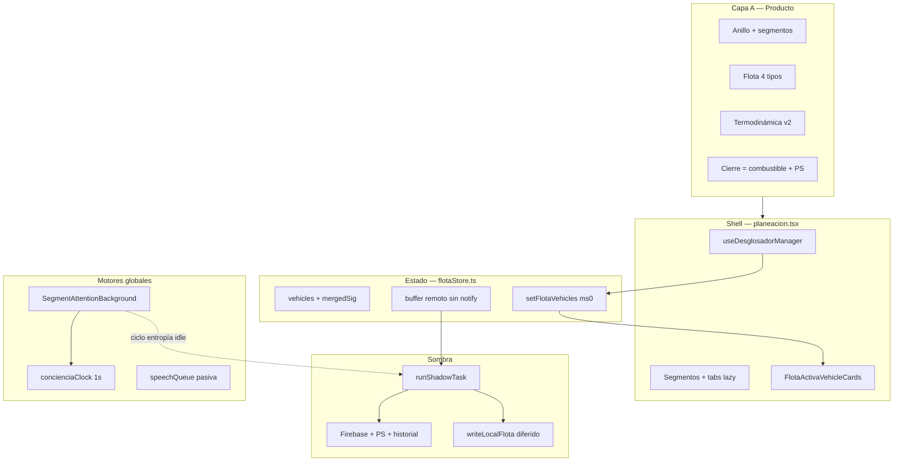

# SISTEMICAR — TRONCO DE LA JORNADA (V2.0)

> Ancla arquitectónica del módulo **Planificación / Jornada** (`/planeacion`).  
> Todo código nuevo en este mundo debe ramificarse desde aquí.  
> **No confundir con otros mundos** (Espejo, Alquimia, Radar): cada uno tiene su tronco propio.

**Fuentes canónicas:** `EMBUDO_PLANIFICACION.md` · `TERMODINAMICA_ATENCIONAL_V2.md` · `ESPECIFICACION_planificacion.md` · `BRIEF_BLOQUEO_HILO_PRINCIPAL_ESPECIALISTA.md`

---

## CAPA A — FILOSOFÍA OPERATIVA (INNEGOCIABLE)

La Jornada no es un calendario rápido. Es un **motor de cierre consciente por capas**: presencia → entrada → producción.

### A.1 Axiomas del operador

| Axioma | Regla para el código |
|--------|----------------------|
| **Conciencia = darse cuenta** | La UI debe hacer visible lo que el operador no ve solo: entropía, fricción, cobertura del día. |
| **Coraje (RETO) tiene valor intrínseco** | Archivar un reto difícil sigue siendo cierre válido; PS y feedback no dependen solo de “cumplido perfecto”. |
| **El tanque se llena al cerrar** | Combustible, PS, celebraciones de bloque y toasts van ligados al **cierre** (sub, bloque, vehículo), no a abrir la app ni a planificar. |
| **Maestría = dominio fluido** | Termodinámica v2 mide progreso por **↑ dominio fluido** y **↓ fricción**, no por “más bloques al límite”. Ver `termodinamicaAtencional.ts`. |
| **Medimos cierres y decisiones** | No competimos con calendarios; competimos con evidencia de agencia en el día. |

### A.2 Pilares de producto (no son “ruido técnico”)

Cada pilar es **capacidad vendible**. Optimizar rendimiento **nunca** elimina el pilar; solo cambia **cómo y cuándo** se calcula.

| Pilar | Peldaño | Rol en la experiencia |
|-------|---------|------------------------|
| Anillo de conciencia | Base | Mapa conquista / entropía / libre del día |
| Segmentos + omisión | Base | Estructura temporal + alerta de huecos |
| Flota (Conquista · Enfoque · Descanso · Verdad) | Base | Misión con criterio de cierre antes de actuar |
| PS + economía de cierre | Base | Feedback dopaminérgico **consciente** al cerrar |
| Entrenamiento panorámico | Base | Alternar zoom out / zoom in durante la jornada |
| Termodinámica atencional v2 | Base–Operativo | Resistencia, fase, dominio fluido vs ayer |
| Combustible + decisiones | Base–Soberanía | “Hoy resolviste N decisiones” |
| Desglosador conquista + ruta enfoque + voz | Operativo | Unidades, ritmo, bandas fluido/concentrado/límite |
| Ring situacional + Crisol (MOS) | Soberanía | Bloques 3+3, imprevistos, fe en proyectos |

**Ley de oro del tronco:** si una optimización hace invisible o inoperable un pilar de esta tabla, la optimización está **mal**.

### A.3 Autarquía por tipo de proceso

Cada proceso consciente tiene leyes propias. Mezclarlos en un solo patrón genera cortocircuitos.

| Proceso | Qué enseña | ms0 obligatorio | Sombra permitida |
|---------|------------|-----------------|------------------|
| Tap en desglosador tiempo | Ritmo, bandas, pitido | Contador, estado sub, banda activa | Firebase, PS, historial |
| Cierre sub con ruta | Declaración del operador | Modal pregunta + veredicto visible | Ledger, snapshot termo |
| Cierre bloque situacional | Victoria / absorción | Overlay celebración + estado ring | Persistencia, entropía catch-up |
| Tick segment attention | Omisión, puertas, entropía | Pulso reloj anillo (1 s) | `runSegmentAttentionCycle` completo |
| Snapshot Firebase | Sincronía multi-dispositivo | Ninguno (buffer silencioso) | Escritura disco + notify React |

---

## CAPA B — LEYES TÉCNICAS (DERIVADAS DE A)

### B.1 Las cuatro leyes de pulso

#### 1. Fase ms0 — Prioridad del operador

Todo **gesto del operador** (tap, cerrar sub, absorber victoria, marcar cumplido) debe:

1. Mutar estado local indexado (`setFlotaVehicles` / store).
2. Pintar React en el **mismo frame** (o el siguiente como máximo).
3. Mostrar feedback de cierre visible (toast, modal, contador, celebración) **antes** de Firebase.

**Prohibido en ms0:** `JSON.stringify` de flota completa, `updateVehicle` Firebase, inyección PS, recálculo de historial, `buildConcienciaTimeline`.

#### 2. Sombra — Trabajo pesado fuera del tick de React

Usar `runShadowTask` / `runShadowTaskAsync` (`desglosadorShadow.ts`) para:

- Escrituras Firebase
- PS, diarios transaccionales, profundidad desglosador
- Historial, snapshots planilla, reconciliaciones profundas
- Serialización pesada de disco

La sombra **no sustituye** el feedback ms0 del cierre; lo **sigue**.

#### 3. Audio pasivo — Cola estéril

TTS y sonidos **nunca** dentro de `useEffect` de render ni en handlers síncronos largos.

- Despachar con `enqueueDesglosadorVoicePassive` / cola en `speechQueue.ts`
- Un solo canal de retry por app; **prohibido** `pointerdown` global por frase
- Cleanup obligatorio al desmontar vehículo (`cancelUbicacionVoiceForVehicle`)

#### 4. UI espejo — Cero lógica de negocio en caliente

`VehicleCard.tsx`, `planeacion.tsx` (shell) y componentes de tarjeta **mapean** datos pre-calculados.

- Cálculos de termodinámica, disciplina, listas activas, banners → `useMemo` en hook o funciones puras
- **“Espejo” ≠ “mudo”:** celebraciones, modales de ruta y anillo son parte del producto; solo su **cómputo** no vive en el JSX

### B.2 Flujo de datos (tap vs red)

```
OPERADOR (tap)
  → patch en memoria
  → setFlotaVehicles()
  → notify() INMEDIATO
  → feedback visible de cierre (ms0)
  → runShadowTask(() => Firebase + PS + historial + disco)

FIREBASE (snapshot remoto)
  → reconcile (firma vehiclesReactiveSignature)
  → si firma igual: NO notify, NO disco
  → si cambió: setVehiclesBufferOnly()
  → runShadowTask(() => writeLocalFlota)   ← NUNCA síncrono en hot path
  → scheduleRemoteSnapshotNotify → rAF → React
```

**Corrección V1:** escribir disco síncrono en cada snapshot bloqueaba móvil. Disco va en sombra; notify solo si la firma cambió.

### B.3 Scheduler único de conciencia (objetivo sistémico)

Hoy conviven motores paralelos (`SegmentAttentionBackground`, `concienciaClock`, timers por `VehicleCard`, centinela). **Meta:**

Un coordinador serializa con **tope de ms por frame**:

| Trabajo | Frecuencia | Prioridad |
|---------|------------|-----------|
| Pulso reloj UI (`dispatchConcienciaClockTick`) | 1 s fg / 5 s bg | Alta — segunderos |
| Ciclo segmentos/entropía (`runSegmentAttentionCycle`) | 10–25 s | Media — producto Base |
| Catch-up anillo / timeline | idle, bajo demanda | Baja |
| Persistencia flota | debounce 500 ms + flush en cierre | Baja |

**No destruir entropía** para ganar FPS. **Presupuestarla** en idle.

Estado: **parcial+** — `concienciaScheduler.ts` serializa pulso UI + cola presupuestada (`enqueueConcienciaWork`); `SegmentAttentionBackground` encola el ciclo de segmentos. Persistencia con skip por firma (`vehiclesReactiveSignature`) y teardown situacional en sombra. Ver brief § Capa A/B/C.

**Lanzamiento flota (`/planeacion`):** el toast es ms0 barato; el freeze clásico era la avalancha *después*. Timeline de control: disco **1.5 s**, Firebase `launchPaint` **4 s**, persist remoto **12 s** (sin `addVehicle`/re-stringify — usa `scheduleVehicleRemotePersist`), pilares **14 s**, archive centinela **18 s**. Expand móvil diferido para situacional y conquista grande. Sin segundo `VehicleCardLiveNow` anidado. El clavo en ~06 confirmó que la sombra a 5.5s con `addVehicle` era el siguiente pico.

### B.4 Persistencia fuera del hot path

| Regla | Estado |
|-------|--------|
| Debounce global escritura flota (~500 ms) | Parcial / objetivo |
| Flush forzado en `visibilitychange` y cierre vehículo/bloque | Objetivo |
| No escribir si `vehiclesReactiveSignature` igual | Implementado en `flotaStore.ts` |
| Escritura incremental (delta por vehículo / IndexedDB) | Objetivo futuro |
| `writeLocalFlota` solo en sombra | **Ley V2 — migrar** |

### B.5 Ciclo de vida estricto (ring situacional)

Al cerrar bloque situacional, orden **imperativo**:

1. `teardown()` timers + voz + listeners del vehículo
2. Patch ms0 + feedback celebración
3. Sombra: Firebase, PS, entropía catch-up

Celebración UI **después** de teardown, no antes. Evita freeze + overlay negro huérfano.

### B.6 Ley sistémica — una clase, una solución

**Prohibido** cerrar un issue con un parche que solo aplique al síntoma reportado (ej. «solo desglosador conquista colapsado») sin:

1. Identificar la **clase** de problema (tick en monolito, ms0 roto, reconcile, etc.).
2. Verificar **todos los procesos** de § A.3 que comparten esa clase.
3. Añadir **contrato en código** + test que impida regresión.
4. Pasar el checklist § REGLA DE DECISIÓN para **cada** proceso afectado.

**Criterio de rechazo:** si el fix introduce un segundo patrón paralelo (ej. tick en padre para situación y island para conquista), el PR se rediseña antes de merge.

**Implementación de referencia (ticks UI):** `VehicleCard` no suscribe ticks; cada proceso usa un **island** (`DesglosadorSubLiveIsland`, `SituacionRelojIsland`, etc.) con `useVehicleTimerTick` interno. `vehicleCardNeedsLiveTick` devuelve `false` siempre.

---

## MAPA DE ARQUITECTURA



### Responsabilidades por archivo

| Archivo | Rol |
|---------|-----|
| `useDesglosadorManager.ts` | Orquestador Jornada: handlers ms0, useMemo estériles, modales |
| `flotaStore.ts` | Fuente de verdad memoria + firma + merge Firebase |
| `planeacion.tsx` | Shell: segmentos, tabs, wiring — **no** lógica pesada nueva |
| `VehicleCard.tsx` | Espejo por vehículo: render + handlers delgados |
| `SegmentAttentionBackground.tsx` | Motor entropía/puertas global |
| `desglosadorShadow.ts` | Primitiva sombra |
| `termodinamicaAtencional.ts` | Funciones puras fase/resistencia/compare v2 |
| `jornadaFlotaCache.ts` | Disco local flota |

**Dirección de split (no más monolito):** shell ligero → cards lazy → métricas/anillo en tab diferido. Nuevas features **no** expanden `planeacion.tsx`; van a hook, lib pura o componente lazy.

**V3 paso 2 (completado):** `/jornada-v3` entra por `planeacionV3.tsx` + `useJornadaFlotaCore` (sin manager). La sesión V3 (`planeacionV3Session.tsx`) usa `useJornadaFlotaCore` para flota y `useJornadaV3Ops` para ring/reserva/desglosador — `useDesglosadorManager` ha sido eliminado de la sesión V3. Test en `useJornadaFlotaCore.test.ts` garantiza que ni el entry ni la sesión importan el manager. Siguiente: partir conquista fuera del manager en la ruta `/planeacion` monolítica.

**Foco unidad (conquista):** overlay naranja opcional (`ConquistaUnitFocusOverlay`) — mide segundos/minutos por unidad para concentración; Reiniciar; al salir se apaga. No escribe a récord/PS/historial.

---

## REGLA DE DECISIÓN AL CODIFICAR

Antes de cada cambio, responder en orden:

1. **¿Qué pilar del embudo toca?** (§ A.2) — si ninguno, ¿por qué está en Jornada?
2. **¿Qué debe ver el operador en ms0?** — si es un cierre, debe haber feedback visible.
3. **¿Qué va a sombra?** — Firebase, PS, disco, timeline pesado.
4. **¿Respeta autarquía del proceso?** (§ A.3) — ring ≠ desglosador tiempo ≠ tick global.
5. **¿Aumenta trabajo síncrono en snapshot o render?** — si sí, rediseñar.

### Permitido vs prohibido

| Permitido | Prohibido |
|-----------|-----------|
| Debounce/coalesce con **flush en cierre** | Debounce que **trague** feedback de cierre al operador |
| Defer / idle para entropía y anillo | Eliminar segment attention “porque bloquea” |
| `requestIdleCallback` con timeout | `JSON.stringify` flota completa en handler de tap |
| Parches con ticket hacia scheduler/persistencia | Parches sin ruta al tronco V2 |
| Kill switch móvil (voz/anillo off) | Silenciar producto Base sin opt-in |

---

## CRITERIOS DE ÉXITO (JORNADA EN MÓVIL)

1. Abrir `/planeacion` con vehículo situacional activo: **< 3 s** hasta UI usable.
2. Cerrar desglosador situacional: freeze perceptible **< 500 ms**; voz operativa o silenciada limpio.
3. Tras 5 ciclos abrir/cerrar Jornada: resto de la app responde.
4. Operador ve entropía, cierre de bloque y progreso termo — **sin** sacrificar pilares Base.

---

## HISTORIAL DE VERSIONES

| Versión | Cambio |
|---------|--------|
| V1.0 | Pulso ms0 + sombra; omitía filosofía; contradecía embudo (entropía “destruida”, disco síncrono) |
| V2.0 | Dos capas (filosofía + técnica), autarquía, flujo datos corregido, pilares embudo, scheduler/persistencia como meta explícita |
| V2.1 | § B.6 Ley sistémica; ticks UI en islands (no monolito VehicleCard) |

---

*Actualizar este archivo cuando cambie un pilar de producto o una ley técnica de la Jornada. Otros mundos de SISTEMICAR no heredan estas reglas automáticamente.*
